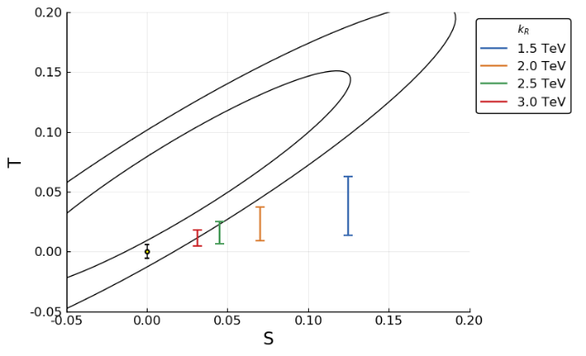
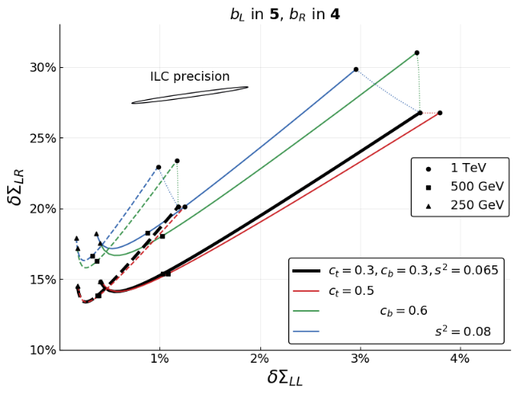

# Computing for Extra-Dimensional Higgs Boson

This is a Julia source code repository for various numerical computations in Gauge-Higgs Unification models. 

## Introduction

### Higgs Boson
The Higgs boson is a newly discovered particle in 2012 and is believed to be the source of mass of all the other particles. Particle physicists believe that the Higgs field exists in the background of the entire space and other particles get massive by interacting with this field. As an analogy, imagine that you walk inside a river or in a swimming pool. As you walk through the water, you feel resistance as your body continuously interacts with water. The resistance can be thought as an effective mass of your body inside the water. Similarly, when e.g. an electron moves from a point to another, it interacts with the Higgs field in the background continuously and becomes massive.

### Gauge-Higgs Unification
There are many different models which try to explain why the Higgs field is spread throughout the entire space. A popular class of models is to assume that there exists a small hidden spatial dimension, in addition to the usual three spatial dimensions. In this setting, there appears a new particle (as a partner of gauge fields) which can naturally satisfy the properties of the observed Higgs boson. This framework is called Gauge-Higgs Unification.

### Numerical Computations in Julia
Studying the properties of the Gauge-Higgs unfication models requires 
1. Integration of complicated combinations of Bessel functions
2. Minimization of the integral 
3. Parameter space fitting and plotting 

and so on. This suggests that Julia is a natural choice of programming language to study these models, with its superior numerical performance compared to Python and easier interface for plotting, etc than C++. 

## List of notebooks 
Our work focuses on an SO(5)xU(1) model of Gauge-Higgs Unification. However, it is straightforward to generalized our codes into other models.
1. [RGE](RGE) Compute values of relevant parameters at 2 TeV energy scale using Renormalization Group Equations. 
2. [SO5](SO5) Compute the minimum of the Higgs potential. Find parameter space with observed Higgs mass. Compute Z' masses in the allowed region. Both for colored top partner and uncolored top partner.

## Sample Plots
| |
|:--:| 
| S-T contour and the model space. |

| |
|:--:| 
| Bottom quark pair production helicity cross section deviations. |

## Talk Slides
1. Electroweak symmetry breaking in SO(5)xU(1) Gauge-Higgs Unification models. ([slides](slides/ewsb.pdf))
2. Fermion pair production in SO(5)xU(1) Gauge-Higgs Unification models. ([slides](slides/pair_production.pdf))

## References
1. Competing Forces in 5-Dimensional Fermion Condensation (with M. E. Peskin). \
[arXiv:1709.07909 [hep-ph]](https://arxiv.org/abs/1709.07909), Phys. Rev. D96 115030 (2017).
2. Dissection of an SO(5)xU(1) Gauge-Higgs Unification Model (with M. E. Peskin). \
[arXiv:1810.12352 [hep-ph]](https://arxiv.org/abs/1810.12352), submitted to Phys. Rev. D.
3. Fermion Pair Production in SO(5)xU(1) Gauge-Higgs Unification Models (with M. E. Peskin). \
[arXiv:1811.07877 [hep-ph]](https://arxiv.org/abs/1811.07877), submitted to Phys. Rev. D.
